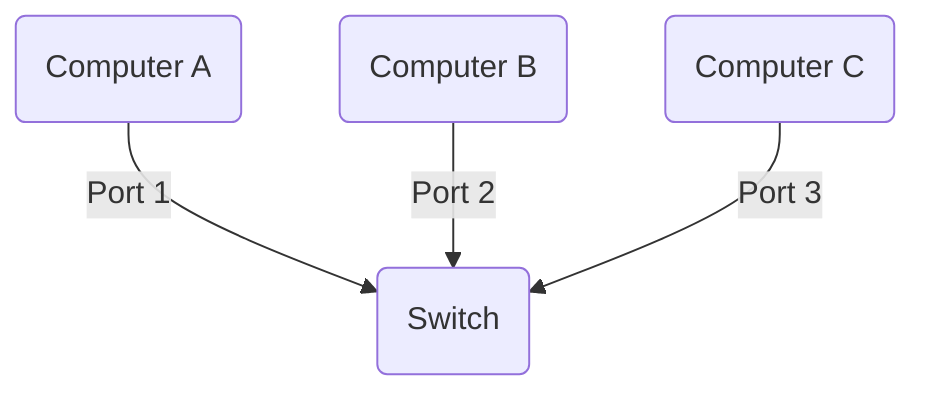

Switch connects devices within a network (often a [[LAN]]) and forwards data [[packet|packets]] to and from those devices. 

Unlike a [[router]], a switch only sends data to the single device it is intended for (which may be another switch, a [[router]], or a user's computer), not to networks of multiple devices.

**Layer 2 switches** forward data based on the [[MAC|MAC address]], while **layer 3 switches** forward data based on the destination [[IP address]]). Some switches can do both but mostly they're layer 2 🙁.

# How switch knows about [[MAC]] if its not part of [[packet]]?
Layer 2 network switches maintain a [[CAM]] table in memory that matches [[MAC|MAC addresses]] to the switch's Ethernet ports.

Let's imagine Switch had just turned on and its table is empty. Suppose `Computer A` sends a message to `Computer B`. The switch takes the following steps to get the message to `Computer B` and start filling out its CAM table:

1. It records `Computer A`'s MAC address and the port its message came in on
2. It forwards `Computer A`'s message to all other computers on the network (except `Computer A`); this is known as **flooding**
3. When `Computer B` finally replies, switch records `Computer B`'s [[MAC|MAC address]] and port as well

# Switch vs [[router]]
[[router|Routers]] are necessary for an Internet connection as they connects with different networks and forwarding data from network to network — including [[LAN|LANs]], [[WAN|WANs]], or autonomous systems, while **switches are only used for interconnecting devices**.
