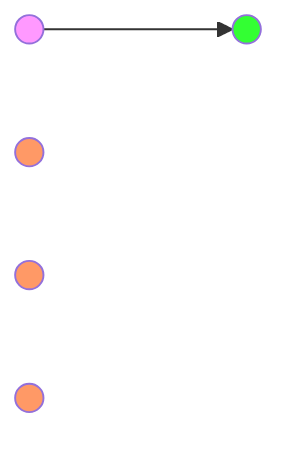
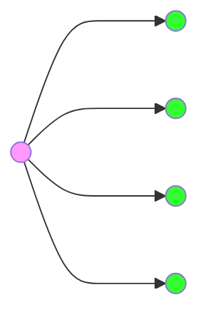
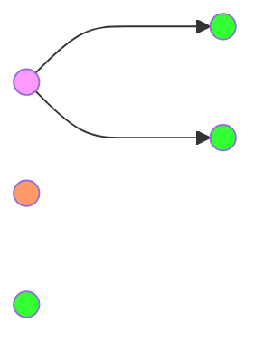
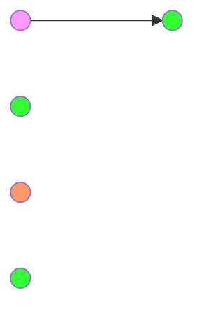

# Unicast

# Broadcast

# Multicast
Delivers a message to a group of nodes **that have expressed interest** in receiving the message using a _one-to-many-of-many_ or _many-to-many-of-many_ association; datagrams are routed simultaneously in a single transmission to many recipients. 
Multicast differs from broadcast in that the destination address designates a subset, not necessarily all, of the accessible nodes.

# Anycast

